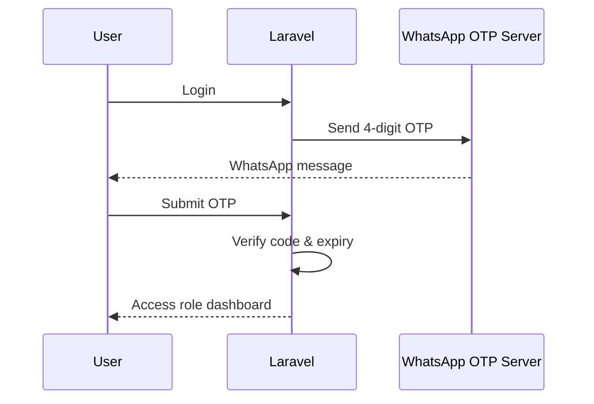
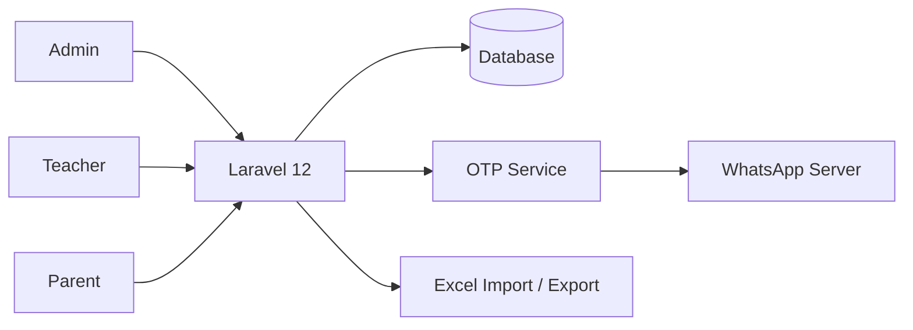

<div align="center">

# 🏫 Monitoring 7 Kebiasaan Anak Indonesia Hebat

### School, teacher, and parent collaboration platform for student habit monitoring

[](https://laravel.com/)
[](https://www.php.net/)
[](#authentication--otp)
[](https://laravel-excel.com/)

</div>

---

## Overview

This application supports monitoring of **7 Kebiasaan Anak Indonesia Hebat (7KAIH)** through collaboration between school administrators, teachers, and parents.

The system separates workflows by role. Administrators manage school master data, teachers monitor student journals and learning materials, while parents record children's daily habits and communicate feedback.

Authentication is strengthened with a WhatsApp OTP verification step before users access protected application areas.

## User Roles

### 🛠 Administrator

- Admin dashboard
- Manage teachers
- Manage classes
- Manage students
- Manage parents
- Assign / remove students from classes
- Import teacher data from Excel
- Import student data from Excel

### 👨‍🏫 Teacher

- Teacher dashboard
- Create and manage learning materials
- Monitor student journals
- Daily journal monitoring
- Inspect journal history by student
- Export monthly monitoring data to Excel
- Export individual student journal data

### 👨‍👩‍👧 Parent

- Parent dashboard
- View children's learning materials
- View material detail
- Submit feedback
- View feedback history
- Record children's daily habit journals
- View journal history

## Authentication & OTP



OTP codes are generated for each user and expire after **5 minutes**.

The WhatsApp sender is configured through:

```env
WA_SERVER_URL=
```

A related WhatsApp server project is available at:

**[wa-server-bot →](https://github.com/bayupra7ama/wa-server-bot)**

## System Architecture



## Tech Stack

| Area | Technology |
| --- | --- |
| Backend / Web | Laravel 12 |
| Language | PHP 8.2+ |
| Authentication | Laravel auth + OTP middleware |
| OTP Channel | WhatsApp integration |
| Frontend | Blade + Vite |
| Data Import / Export | Maatwebsite Laravel Excel |
| Database | Laravel-supported relational database |
| Testing | PHPUnit |

## Main Domain Model

```text
User
├── Admin
├── Guru
└── Orang Tua
      │
      └── Student
           ├── Class Room
           └── Jurnal

Guru
├── Materi
└── Monitoring Jurnal

Materi
└── Feedback
```

## Project Structure

```text
app/
├── Exports/             # Monthly journal Excel exports
├── Imports/             # Teacher / student Excel imports
├── Http/
│   ├── Controllers/
│   │   ├── Admin/
│   │   ├── Guru/
│   │   └── Orangtua/
│   └── Middleware/
│       ├── OtpVerified.php
│       └── RoleMiddleware.php
├── Models/
└── Services/
    └── OtpService.php

resources/views/
├── admin/
├── guru/
├── orangtua/
└── auth/
```

## Installation

### Requirements

- PHP 8.2+
- Composer
- Node.js & npm
- Database supported by Laravel
- WhatsApp OTP server reachable from Laravel

### 1. Clone

```bash
git clone https://github.com/bayupra7ama/monitoring-7KAIH-sekolah.git
cd monitoring-7KAIH-sekolah
```

### 2. Install dependencies

```bash
composer install
npm install
```

### 3. Environment

```bash
cp .env.example .env
php artisan key:generate
```

Configure database settings and the WhatsApp service:

```env
WA_SERVER_URL=http://YOUR-WHATSAPP-SERVER
```

### 4. Database

```bash
php artisan migrate
php artisan db:seed
```

### 5. Run

```bash
composer run dev
```

Or run the services separately:

```bash
php artisan serve
npm run dev
```

## Security Notes

- Keep WhatsApp server credentials and application secrets in environment variables.
- Do not commit production `.env` files.
- Use HTTPS in production.
- Apply appropriate access control to the WhatsApp OTP service.
- Rate-limit OTP endpoints in production environments.

---

<div align="center">

Built to connect school monitoring, teacher insight, and parent participation in one workflow.

</div>
